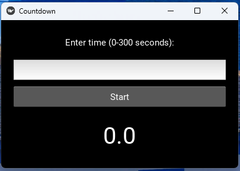

# Kivy Countdown Timer

A simple, accurate countdown timer application built with Python and Kivy framework.



## Features

- Input field for timer duration (0-300 seconds)
- Start button to begin countdown
- Real-time timer display with 0.1 second precision
- Input validation
- Clean, modern UI with vertical layout

## Requirements

- Python 3.x
- Kivy 2.3.1 and dependencies (see requirements.txt)

## Installation

1. Clone this repository:
```
git clone https://github.com/yourusername/kivy-countdown-timer.git
cd kivy-countdown-timer
```

2. Set up a virtual environment and install the dependencies:
```
make setup
```
or manually:
```
python -m venv venv
source venv/bin/activate  # On Windows: venv\Scripts\activate
pip install -r requirements.txt
```

## Usage

### Running the Application

```
make run
```
or manually:
```
python main.py
```

### Using the Timer
1. Enter a time value between 0 and 300 seconds
2. Click the "Start" button
3. Watch the countdown
4. The Start button will be re-enabled when the timer completes

## Project Structure

- `main.py` - Application entry point
- `countdown_timer.py` - UI component definition
- `timer_logic.py` - Timer business logic
- `timer_unittest.py` - Unit tests for timer accuracy
- `makefile` - Build and run automation
- `requirements.txt` - Project dependencies

## Development

### Running Tests

```
make test
```

### Formatting Code

```
make format
```

### Building Executable

```
make build
```

### Updating Dependencies

```
make freeze
```

## How It Works

The application is divided into three main components:

1. **UI Layer** (`countdown_timer.py`): Handles the visual elements and user interaction
2. **Logic Layer** (`timer_logic.py`): Manages timer functionality, validation, and callbacks
3. **Application Layer** (`main.py`): Sets up the Kivy application and window properties

The timer uses Kivy's Clock scheduler to update the countdown display at 0.05-second intervals, ensuring smooth and accurate time progression.

## Testing

The application includes unit tests that verify:
- Timer accuracy across different durations
- Input validation functionality
- Proper callback execution
- Timer completion events

## License

[MIT License](LICENSE)
